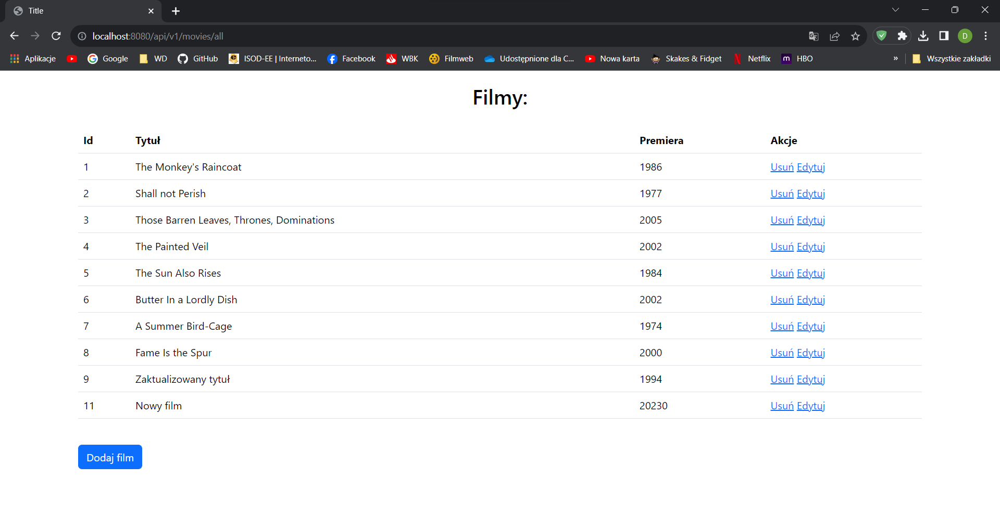
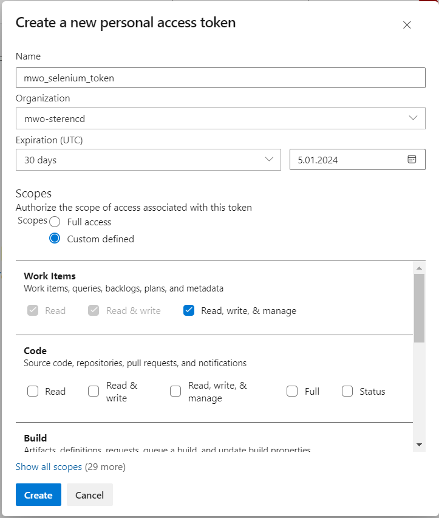
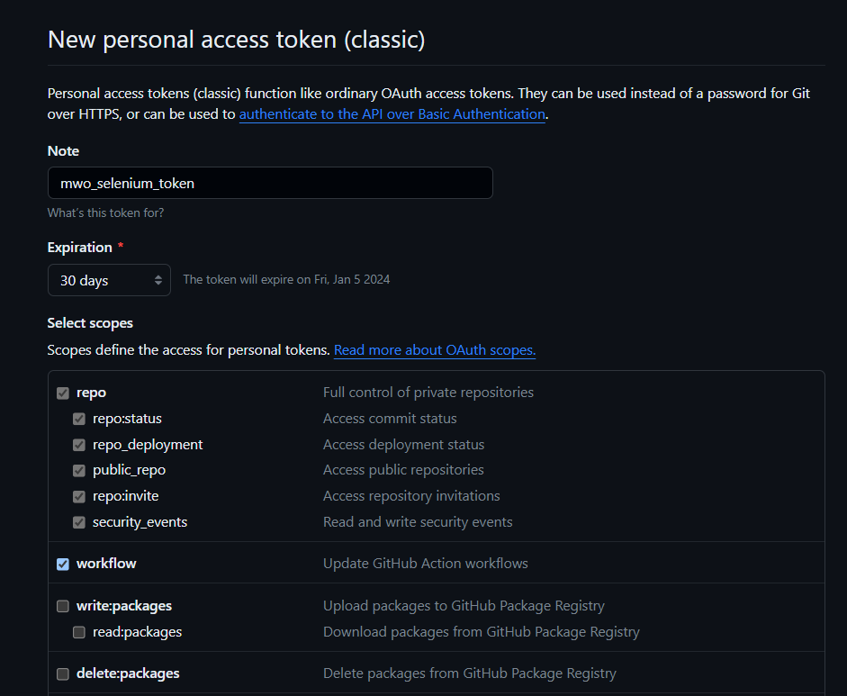
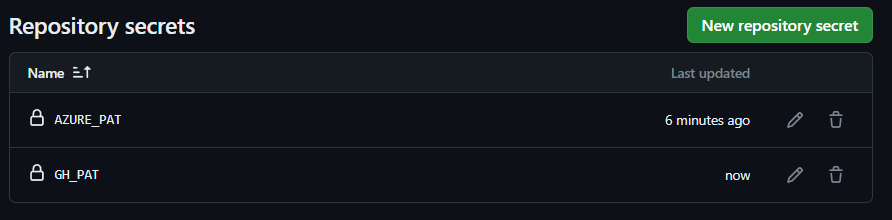

# MWO - Projekt

## Aplikacja
Testowana aplikacja to prosta aplikacja webowa Java Spring Boot
zawierająca podstawowe operacje CRUD na filmach.




## Testy
Do napisania testów została wykorzystana biblioteka Selenium ( Selenium Webdriver ) oraz JUnit.
Dodatkowo została wykorzystana biblioteka AssertJ oraz Faker do wygenerowania danych o filmach.

Konfiguracja testów (opcja headless pozwala uruchomić testy w środowisku GitHub Actions):

```
    public WebDriver driver;

    @BeforeAll
    static void setupAll() {
        WebDriverManager.chromedriver().setup();
    }

    @BeforeEach
    void setup() {
        ChromeOptions chromeOptions = new ChromeOptions();
        chromeOptions.addArguments("--headless");
        driver = new ChromeDriver(chromeOptions);
    }

    @AfterEach
    void teardown() {
        driver.quit();
    }
```

### Przykładowe napisane testy
```
    @Test
    public void shouldGetMoviesList() {
        driver.get("http://localhost:8080/api/v1/movies/all");
        WebElement table = driver.findElement(By.className("table"));
        List<WebElement> rows = table.findElements(By.tagName("tr"));
        Assertions.assertNotNull(table);
        Assertions.assertFalse(rows.isEmpty());
    }
    
    @Test
    public void shouldDeleteMovie() {
        driver.get("http://localhost:8080/api/v1/movies/all");
        List<WebElement> moviesBefore = driver.findElements(By.tagName("tr"));
        int numberOfMovies = moviesBefore.size();

        List<WebElement> deleteButtons = driver.findElements(By.className("delete-button"));
        System.out.println(deleteButtons.get(deleteButtons.size()-1));
        WebElement button = deleteButtons.get(deleteButtons.size()-1);
        button.click();

        driver.get("http://localhost:8080/api/v1/movies/all");
        List<WebElement> moviesAfter = driver.findElements(By.tagName("tr"));
        Assertions.assertEquals(numberOfMovies - 1, moviesAfter.size());
    }
```

### Film prezentujący pomyślny przebieg testów


https://github.com/sterenczakdawid/mwo5/assets/104166628/180b93e9-b8ad-4045-a547-a67b78a1791a


## Azure i GitHub Actions
Personal access token w azure: 



Github:



Sekrety:



Pipeline:
```
name: Java Selenium

on:
  push:
    branches:
      - main
  pull_request:
    branches:
      - main
  workflow_dispatch:

jobs:
  build:
    runs-on: ubuntu-latest

    steps:
      - uses: actions/checkout@v3
      - name: Set up JDK 17
        uses: actions/setup-java@v3
        with:
          java-version: '17'
          distribution: 'temurin'
          cache: maven

      - name: Build with Maven and run tests
        run: mvn clean package

      - name: Tests failed - create item in Azure
        uses: stefanstranger/azuredevops-bug-action@1.1
        if: failure()
        with:
          OrganizationName: "mwo-sterencd"
          PAT: "PAT"
          ProjectName: "mwo test"
          AreaPath: "mwo test"
          IterationPath: "mwo test"
          GithubToken: "GithubToken"
          WorkflowFileName: "main.yml"
        env:
          PAT: ${{ secrets.AZURE_PAT}}
          GithubToken: ${{ secrets.GH_PAT}}
```

## Pokaz działania
Aby testy nie przechodziły dodaję test:
```
    @Test
    public void shouldNotPass() {
        Assertions.fail();
    }
```

Pokaz zgłaszania błędu w Azure:


